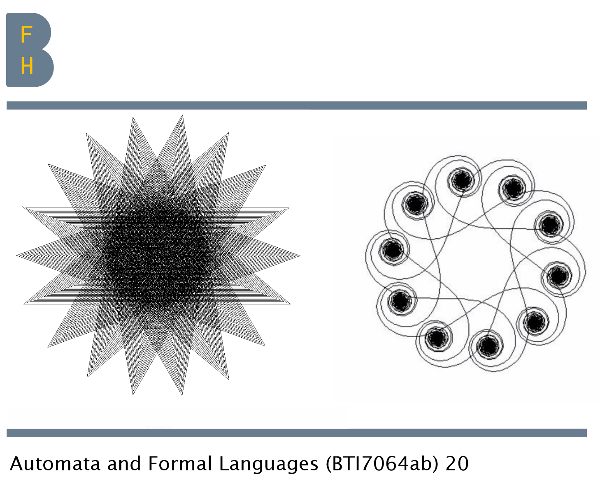
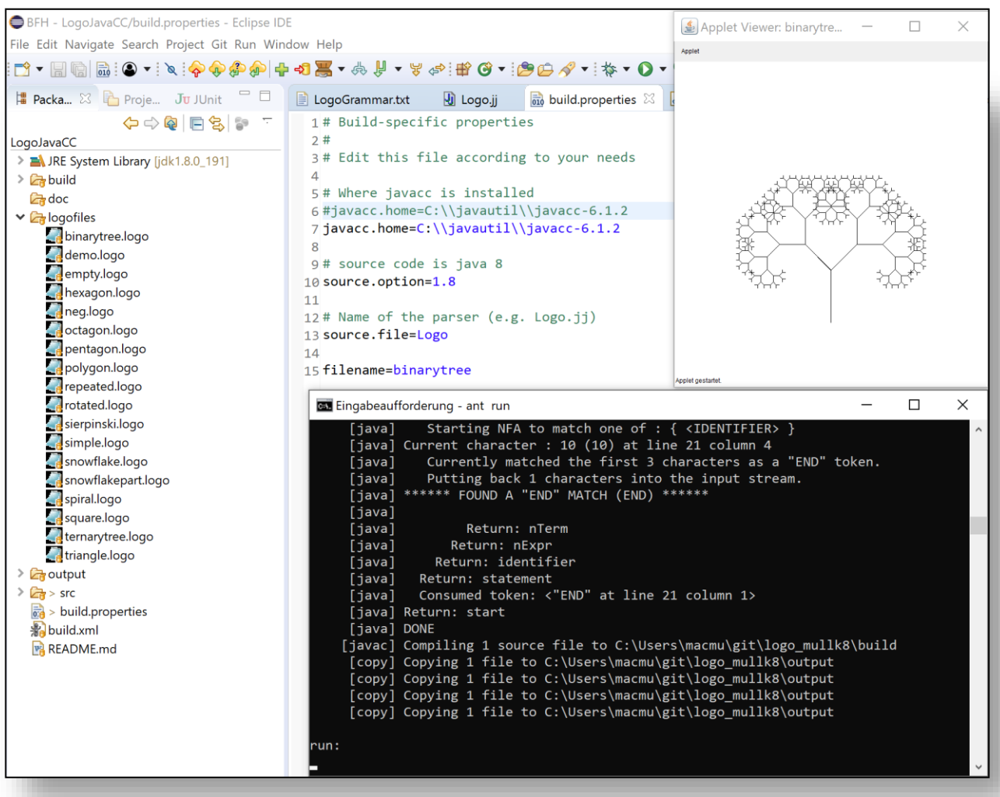

**Bern University of Applied Sciences**

**Automata and Formal Languages (BTI7064ab) 20**

**Project**: Logo

**Autor**: 	Mac Müller

**Advisor**: Prof. Dr. Olivier Biberstein

Introduction:

The objective of this project was to develop a parser/translator from a small subset of the Logo
programming language into Java. The parser was developed by means of JavaCC. The grammar of
translator was provided.

To testing has two possibilities of approaches:
1. With command line “ant run -Dfilename=xxx”. The "xxx" is the filename.
2. Change the "filename=" in "build.properties" file. Then type command line "ant run"
   This approach is more convenience in case of running-error. Debugging with other ant-
   commands was easier.

**Example pictures of testing:**
